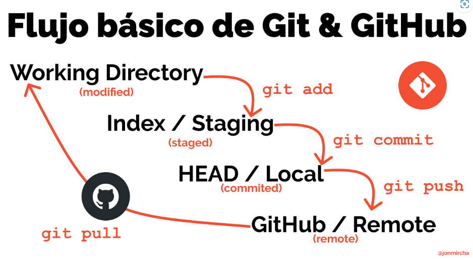

# Jonathan Joel Montesinos Pacheco

## Diseño de videojuegos

Profesor : Hector Guerrero

Estamos aprendiendo a vender nuestro juego.

## Principios de composicion y diseño

Profesor: Roberto Melo Ortiz D' Ora

Aprendemos a utilizar photoshop

## Programacion En lenguaje interpretados

Profesor: Jonathan MirCha

Aprendemos a utilizar github

## Desarollo de app

Profesor: Sebastian Mejia

Estamos aprendiendo a usar mitek y tecnix

## Sistemas operativos y redes

Profesor: Oziel Morales

Empezamos a ver c++

-- Creando version 1.0.0 de este repositorio

### Practica 2 parcial 2

¿Cómo se inicializa un repositorio en Git?

Si se va a inicializar un repositorio en un archivo nuevo se tendria primero que configurar usando los siguientes comandos.

```bash
git config --global user.name "Jonathan Montesinos"

git config --global user.email cdmx2508@amerike.edu.mx

git config --global user.ui true

git config --global init.defaultBranch main

git config --global core.editor "code --wait"

git config --global -e

git config --global core.autocrlf true

git config --global core.autocrlf input
```

ya que se configuro git en la computadora se utiliza el siguiente comando para inicializar la carpeta git en el archivo

```bash
    git init
```

¿Cómo creas un repositorio en GitHub?

Para crear un repositorio en GitHub se debe tener una cuenta propia en GitHub creada

Despues de crear la cuenta se crea el repositorio publico sin README ni con ninguna otra opcion
ya que todo lo demas lo configuraremos con la consola de git.

¿Cómo vinculas un repositorio local de Git con uno remoto en GitHub?

```bash
    git add .

    git commit -m "First commit"

    git remote add origin https://github.com/usuario/repositorio.git

    git push -u origin master
```

¿Cuál es el flujo básico de trabajo en Git y GitHub?

